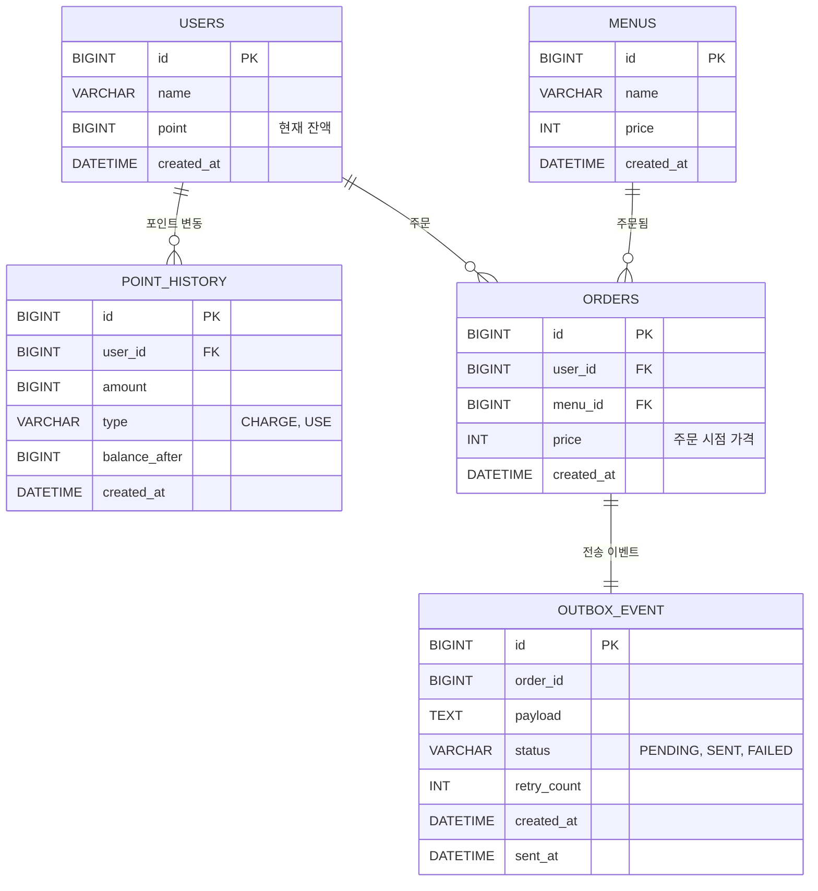

# ☕ Coffee Order System

커피 메뉴 조회, 포인트 충전, 주문/결제, 인기 메뉴 조회 기능을 가진 커피 주문 시스템입니다.

기능 구현뿐만 아니라, 실제 서비스라면 어떤 문제가 생길 수 있을지 고민하면서 **동시성 제어, 데이터 정합성, 외부 시스템 장애 대응**을 중심으로 설계했습니다.

   

| 항목 | 내용                                                                                                      |
|---|---------------------------------------------------------------------------------------------------------|
| 기간 | 2026.09.30 ~ 2026.10.06                                                                                 |
| 인원 | 개인 과제                                                                                                   |
| 핵심 키워드 | 비관적 락, Transactional Outbox, `@TransactionalEventListener`, `FOR UPDATE SKIP LOCKED`, Redis 캐시, 동시성 테스트 |

### 한눈에 보기

| 문제 | 해결 | 검증 |
|---|---|---|
| 같은 사용자의 동시 충전 · 결제로 잔액이 꼬임 | 사용자 행 비관적 락 | 100건 동시 충전 시 잔액 정확 / 잔액 500P에 100P 주문 10건 동시 요청 → 정확히 5건만 성공 |
| 외부 플랫폼 장애가 주문을 실패시킴 | Transactional Outbox + 커밋 후 비동기 전송 + 재전송 스케줄러 | 외부 장애 상황에서도 주문 성공, 복구 후 재전송 확인 |
| 인기 메뉴 집계가 DB에 부담 | 주문 테이블 집계 + 인덱스 + Redis 캐시 | — |

---

## 1. 요구사항

### 기능 요구사항

| 기능 | 설명                                                 |
|---|----------------------------------------------------|
| 메뉴 목록 조회 | 메뉴 ID, 이름, 가격을 조회.                                 |
| 포인트 충전 | 사용자 식별값과 충전 금액을 받아 포인트를 충전. (1원 = 1P)              |
| 커피 주문/결제 | 사용자 식별값과 메뉴 ID를 받아 주문하고, 보유 포인트에서 주문 금액을 차감.       |
| 주문 데이터 전송 | 주문 내역(사용자 식별값, 메뉴 ID, 결제 금액)을 데이터 수집 플랫폼으로 실시간 전송. |
| 인기 메뉴 조회 | 최근 7일간 주문 횟수가 많은 메뉴 3개를 조회하며, 주문 횟수가 정확해야 한다.      |

### 제가 가정한 운영 환경

요구사항에 서버 환경에 대한 조건은 따로 없었지만, "기술 제약사항을 사전에 고려하여 설계"하라는 부분을 보고 실제 서비스라면 어떤 환경일지 먼저 가정하고 시작.

- **서버가 여러 대 떠 있는 환경**이라고 가정했습니다. 그래서 `synchronized`처럼 서버 한 대 안에서만 동작하는 방법은 사용할 수 없다고 판단.
- **같은 사용자가 동시에 요청을 보낼 수 있다**고 가정. (결제 버튼을 두 번 누르거나, 여러 기기에서 동시에 사용하는 경우)
- **포인트, 주문, 외부로 보낸 데이터가 서로 어긋나면 안 된다**고 판단.
- **외부 플랫폼에 문제가 생겨도 주문은 정상적으로 되어야 한다**고 판단.

---

## 2. 기술 스택

| 구분 | 기술 |
|---|---|
| Language | Java 17 |
| Framework | Spring Boot 4.1.1 |
| ORM | Spring Data JPA |
| Database | MySQL |
| Cache | Redis |
| Test | JUnit5, Mockito |

---

## 3. ERD

### 다이어그램



### 테이블 상세

#### USERS

| 컬럼 | 타입 | 설명 |
|---|---|---|
| id | BIGINT PK | 사용자 ID |
| name | VARCHAR | 사용자 이름 |
| point | BIGINT | 현재 포인트 잔액 |
| created_at | DATETIME | 생성일시 |

#### POINT_HISTORY

| 컬럼 | 타입 | 설명 |
|---|---|---|
| id | BIGINT PK | 포인트 내역 ID |
| user_id | BIGINT FK | 사용자 ID |
| amount | BIGINT | 거래 금액 |
| type | VARCHAR | `CHARGE` / `USE` |
| balance_after | BIGINT | 거래 후 잔액 |
| created_at | DATETIME | 거래일시 |

#### MENU

| 컬럼 | 타입 | 설명 |
|---|---|---|
| id | BIGINT PK | 메뉴 ID |
| name | VARCHAR | 메뉴명 |
| price | INT | 현재 가격 |
| created_at | DATETIME | 생성일시 |

#### ORDERS

| 컬럼 | 타입 | 설명 |
|---|---|---|
| id | BIGINT PK | 주문 ID |
| user_id | BIGINT FK | 주문 사용자 |
| menu_id | BIGINT FK | 주문 메뉴 |
| price | INT | 주문 시점 가격 |
| created_at | DATETIME | 주문일시 |

> 인기 메뉴를 조회할 때 최근 7일 데이터만 빠르게 찾기 위해 `(created_at, menu_id)`에 인덱스를 추가.

#### OUTBOX_EVENT

| 컬럼 | 타입 | 설명 |
|---|---|---|
| id | BIGINT PK | 이벤트 ID |
| order_id | BIGINT | 주문 ID (중복 전송 확인용) |
| payload | TEXT | 전송할 데이터 (JSON) |
| status | VARCHAR | `PENDING` / `SENT` / `FAILED` |
| retry_count | INT | 재시도 횟수 |
| created_at | DATETIME | 생성일시 |
| sent_at | DATETIME | 전송 완료일시 |

> 아직 전송되지 않은 이벤트를 찾기 위해 `(status, created_at)`에 인덱스를 추가.

---

## 4. API 명세

### 4.1 메뉴 목록 조회

```http
GET /api/menus
```

**Response — `200 OK`**

```json
[
  { "menuId": 1, "name": "아메리카노", "price": 100 },
  { "menuId": 2, "name": "바닐라라떼", "price": 120 }
]
```

---

### 4.2 포인트 충전

```http
POST /api/users/{userId}/points/charge
```

**Request**

```json
{ "amount": 1000 }
```

**Response — `200 OK`**

```json
{ "userId": 1, "point": 1300 }
```

**Error**

| Error Code | HTTP Status | 설명 |
|---|---|---|
| `INVALID_AMOUNT` | 400 | 충전 금액이 0 이하 |
| `USER_NOT_FOUND` | 404 | 존재하지 않는 사용자 |

---

### 4.3 커피 주문 / 결제

```http
POST /api/orders
```

**Request**

```json
{ "userId": 1, "menuId": 2 }
```

**Response — `201 Created`**

```json
{ "orderId": 100, "menuId": 2, "price": 120, "remainingPoint": 1180 }
```

**Error**

| Error Code | HTTP Status | 설명 |
|---|---|---|
| `USER_NOT_FOUND` | 404 | 존재하지 않는 사용자 |
| `MENU_NOT_FOUND` | 404 | 존재하지 않는 메뉴 |
| `INSUFFICIENT_POINT` | 409 | 포인트 잔액 부족 |

---

### 4.4 인기 메뉴 조회

```http
GET /api/menus/popular
```

**Response — `200 OK`**

```json
[
  { "rank": 1, "menuId": 1, "name": "아메리카노", "orderCount": 123 },
  { "rank": 2, "menuId": 3, "name": "카페라떼", "orderCount": 45 },
  { "rank": 3, "menuId": 2, "name": "바닐라라떼", "orderCount": 23 }
]
```

---

## 5. 설계 의도

테이블을 설계하면서 고민했던 부분들입니다.

- **포인트 잔액과 이력을 나눴습니다.**
  잔액만 있으면 "왜 이 금액이 됐는지" 알 수 없어서, 충전·사용할 때마다 `POINT_HISTORY`에 기록을 남기도록 했습니다. 나중에 잔액이 이상할 때 이력으로 확인할 수 있습니다.

- **주문할 때의 가격을 따로 저장했습니다.**
  처음에는 `MENU`의 가격을 참조하면 된다고 생각했는데, 메뉴 가격이 바뀌면 예전 주문 금액까지 바뀌어 보이는 문제가 있어서 주문 시점 가격을 `ORDERS`에 저장했습니다.

- **인기 메뉴는 주문 테이블에서 직접 셉니다.**
  "주문 횟수가 정확해야 한다"는 조건이 있어서, 별도의 카운터보다는 실제 주문 데이터를 기준으로 집계하는 게 가장 정확하다고 생각했습니다.

- **외부 플랫폼은 인터페이스로 분리했습니다.**
  실제 데이터 수집 플랫폼이 없기 때문에 `DataPlatformClient` 인터페이스를 만들고 지금은 Mock 구현체를 사용합니다. 나중에 실제로 연동하게 되면 구현체만 바꾸면 됩니다.

---

## 6. 문제 해결 전략

### 6.1 포인트 동시성 제어

#### 문제

같은 사용자의 결제 요청이 동시에 들어오면 잔액이 잘못 계산될 수 있습니다.

> 예) 1,000P를 가진 사용자가 800P 결제를 동시에 두 번 요청하면,
> 두 요청 모두 잔액을 1,000P로 읽어서 **둘 다 성공**하고 잔액은 200P가 됩니다.
> 실제로는 두 번째 요청은 잔액 부족으로 실패해야 합니다.


#### 비관적 락

```text
사용자 조회 + 락 (SELECT ... FOR UPDATE)
        ↓
현재 포인트 확인
        ↓
충전 / 차감
        ↓
POINT_HISTORY 기록
        ↓
커밋 → 락 해제
```

#### 이렇게 선택한 이유

- 포인트는 돈과 같기 때문에 **조금 느리더라도 정확한 게 더 중요**하다고 생각했습니다.
- 낙관적 락은 실패하면 다시 시도해야 하지만, 비관적 락은 기다렸다가 **최신 잔액을 보고 처리**하기 때문에 더 단순하고 확실하다고 판단했습니다.

---

### 6.2 주문 데이터를 외부 플랫폼으로 전송하기

#### 문제

처음에는 주문을 저장하면서 바로 외부 플랫폼을 호출하면 된다고 생각했는데, 두 가지 문제가 있었습니다.

- **주문 트랜잭션 안에서 전송하면** → 외부 플랫폼이 고장 나면 주문까지 실패합니다. 외부 응답을 기다리는 동안 DB 락도 계속 잡고 있게 됩니다.
- **주문이 끝난 후 바로 전송하면** → 전송하기 직전에 서버가 꺼지면 데이터가 사라집니다.

찾아보니 이런 문제를 **이중 쓰기 문제(Dual Write Problem)** 라고 부르고, 이를 해결하는 방법으로 **Transactional Outbox 패턴**이 있다는 것을 알게 되었습니다.

#### Transactional Outbox 패턴

핵심은 "바로 보내지 말고, 보낼 데이터를 주문과 함께 DB에 먼저 저장해두자"입니다.

```text
[주문 트랜잭션]
포인트 차감 + 주문 저장 + 보낼 데이터(OUTBOX_EVENT) 저장
        ↓
      커밋

[전송]
① 커밋 직후 바로 전송 시도 (실시간 전송)
   성공 → SENT
   실패 → PENDING 그대로, retry_count + 1

② 스케줄러가 PENDING 상태를 주기적으로 다시 전송
   정해진 횟수 이상 실패 → FAILED (직접 확인 필요)
```

#### 이렇게 선택한 이유

- 주문과 보낼 데이터가 **같이 저장되고, 실패하면 같이 취소**되기 때문에 둘이 어긋나지 않습니다.
- 외부 플랫폼이 고장 나도 **주문은 정상 처리**되고, 데이터는 DB에 남아 있다가 복구되면 전송됩니다.
- 이 경우 잠깐은 우리 DB와 외부 플랫폼의 데이터가 다를 수 있지만, 결국에는 맞춰집니다. 이걸 **최종적 일관성(Eventual Consistency)** 이라고 합니다.
- 분석용 데이터가 조금 늦게 가는 것보다 고객의 주문이 실패하는 게 더 큰 문제라고 생각해서 이 방식을 선택했습니다.

#### 구현하면서 고민한 부분

- **커밋 이후에만 전송**: `@TransactionalEventListener(phase = AFTER_COMMIT)`로 주문 트랜잭션이 커밋된 뒤에만 전송을 시작합니다. 커밋 전에 보내면, 주문이 롤백됐는데 외부에는 데이터가 가 있는 상황이 생기기 때문입니다.
- **사용자는 전송을 기다리지 않음**: 전송은 `@Async`로 별도 스레드에서 실행되어, 주문 응답 시간에 외부 플랫폼의 응답 속도가 영향을 주지 않습니다.
- **즉시 전송과 재전송이 같은 이벤트를 보내지 않도록**: 두 경로 모두 `FOR UPDATE SKIP LOCKED`로 조회해, 누군가 처리 중인 이벤트는 기다리지 않고 건너뜁니다. 서버가 여러 대여도 스케줄러끼리 같은 이벤트를 집지 않습니다.
- **실패 기록이 롤백되지 않도록**: 전송 실패 시 예외를 다시 던지면 트랜잭션이 롤백되어 `retry_count` 증가까지 취소됩니다. 그래서 전송 예외는 잡아서 실패 횟수만 기록하고, 5회 이상 실패하면 `FAILED`로 바꿔 수동 확인 대상으로 분리했습니다.
- **전송 보장 수준은 "최소 한 번(at-least-once)"**: 외부 전송은 성공했는데 `SENT`로 바꾸는 커밋 직전에 서버가 죽으면, 같은 이벤트가 한 번 더 전송될 수 있습니다. 유실보다는 중복이 낫다고 판단했고, 받는 쪽에서 `orderId`로 중복을 걸러낼 수 있도록 payload에 포함했습니다.

---

### 6.3 인기 메뉴 집계

#### 문제

- 최근 7일간 메뉴별 주문 횟수를 **정확하게** 세야 합니다.
- 그런데 조회할 때마다 주문 테이블 전체를 세면, 주문이 많아질수록 DB가 힘들어집니다.


#### DB 집계 + Redis 캐시

```text
인기 메뉴 조회
      ↓
Redis에 저장된 결과가 있나?
   ↓          ↓
  있음        없음
   ↓          ↓
 바로 반환   DB에서 집계
              ↓
        Redis에 저장 (1분)
              ↓
             반환
```

#### 이렇게 선택한 이유

- 실제 주문 데이터를 기준으로 세기 때문에 **주문 횟수가 정확**합니다.
- 결과를 1분 동안 캐싱해서, 같은 조회가 반복될 때 DB를 다시 집계하지 않도록 했습니다.
- 조회수 같은 별도 카운터를 두지 않았기 때문에, 카운터 갱신 누락이나 동시성 문제로 **횟수 자체가 틀어질 일이 없습니다.**
- 대신 캐시 때문에 **최대 1분 전 기준의 순위**가 보일 수 있습니다. "정확해야 한다"는 요구사항은 주문 횟수를 빠짐없이 세는 것으로 해석했고, 1분 정도의 지연은 인기 메뉴 화면 특성상 허용 가능하다고 판단했습니다.
- 최근 7일 주문만 빠르게 찾을 수 있도록 `ORDERS`에 `(created_at, menu_id)` 인덱스를 추가했습니다.

---

## 7. 기술 선택 이유

| 기술 | 선택 이유 |
|---|---|
| MySQL | 포인트와 주문은 트랜잭션과 락이 꼭 필요해서 관계형 DB를 선택했습니다. `FOR UPDATE`, `SKIP LOCKED`도 지원합니다. |
| Redis | 인기 메뉴처럼 자주 조회되고 약간 늦어도 괜찮은 데이터를 캐싱하는 데 사용했습니다. 포인트처럼 정확해야 하는 데이터에는 사용하지 않았습니다. |
| Outbox 패턴 | 추가 인프라 없이 DB 트랜잭션만으로 데이터 유실을 막을 수 있어서 선택했습니다. |
| Mockito | 실제 외부 플랫폼이 없어서 Mock으로 대신했고, 일부러 장애 상황을 만들어서 설계가 잘 동작하는지 확인하는 데 사용했습니다. |

---

## 8. 설계 요약

| 문제 | 해결 방법 | 목적 |
|---|---|---|
| 동시에 포인트 변경 | 비관적 락 | 포인트 정합성 보장 |
| 주문 + 외부 데이터 전송 | Transactional Outbox | 외부 장애가 주문에 영향 주지 않도록 + 데이터 유실 방지 |
| 인기 메뉴 반복 집계 | DB 집계 + Redis 캐시 | 정확한 집계 + DB 부담 감소 |
| 메뉴 가격 변경 | 주문 시점 가격 저장 | 예전 주문 금액 보존 |
| 포인트 변경 추적 | POINT_HISTORY | 충전/사용 기록 확인 |

---

## 9. 테스트

설계에서 고민한 문제들이 실제로 해결되는지 **실제 DB를 사용하는 통합 테스트**로 검증했습니다.

### 동시성

| 테스트 | 시나리오 | 결과 |
|---|---|---|
| `PointConcurrencyTest` | 같은 사용자가 100P씩 **100번 동시 충전** | 잔액 10,000P, 포인트 이력 100건 |
| `OrderConcurrencyTest` | 잔액 500P인 사용자가 100P 메뉴를 **10번 동시 주문** | 성공 5건, 실패 5건, 잔액 0P, 주문 5건 |

동시 요청은 `ExecutorService`로 여러 스레드에서 실행하고, `CountDownLatch`로 모든 요청이 끝날 때까지 기다린 뒤 결과를 확인했습니다.

### 외부 전송 (Outbox)

외부 플랫폼은 `@MockitoBean`으로 대체하고, 일부러 예외를 던지게 해서 장애 상황을 재현했습니다.

| 테스트 | 확인한 내용 |
|---|---|
| 정상 전송 | 주문 후 이벤트가 `SENT`로 바뀜 |
| 외부 장애 | 외부 플랫폼이 실패해도 **주문은 성공**하고, 이벤트는 `PENDING` + `retry_count = 1`로 남음 |
| 장애 복구 | 외부 플랫폼이 복구되면 재전송 스케줄러가 보내서 `SENT`로 바뀜 |
| 주문 실패 | 포인트 부족으로 주문이 실패하면 **Outbox 이벤트도 저장되지 않음** |

---

## 10. 실행 방법

```bash
# Redis 실행
docker compose up -d redis

# MySQL에 데이터베이스 생성
mysql -u root -p -e "CREATE DATABASE coffee;"

# 애플리케이션 실행 (data.sql로 샘플 메뉴·사용자 자동 입력)
./gradlew bootRun

# 테스트 실행
./gradlew test
```

---

## 11. 개선 및 추가 계획

- **재전송 간격 늘리기(Exponential Backoff)**: 지금은 실패한 이벤트를 10초마다 다시 보내서, 외부 장애가 1분 이상 이어지면 바로 `FAILED`가 됩니다. `next_retry_at` 컬럼을 두고 실패할수록 재시도 간격을 늘리는 방식으로 바꾸려 합니다.
- **`FAILED` 이벤트 모니터링**: 수동 확인 대상이 쌓이면 알림을 보내는 기능이 필요합니다.
- **PG사 연동**: 지금은 포인트를 바로 충전하지만, 실제 결제(PG)를 거쳐 충전하는 흐름을 구현하려 합니다.
- **Kafka 적용**: Outbox 테이블의 이벤트를 Kafka로 발행하는 방식(Polling Publisher / CDC)도 공부해 보고 싶습니다.